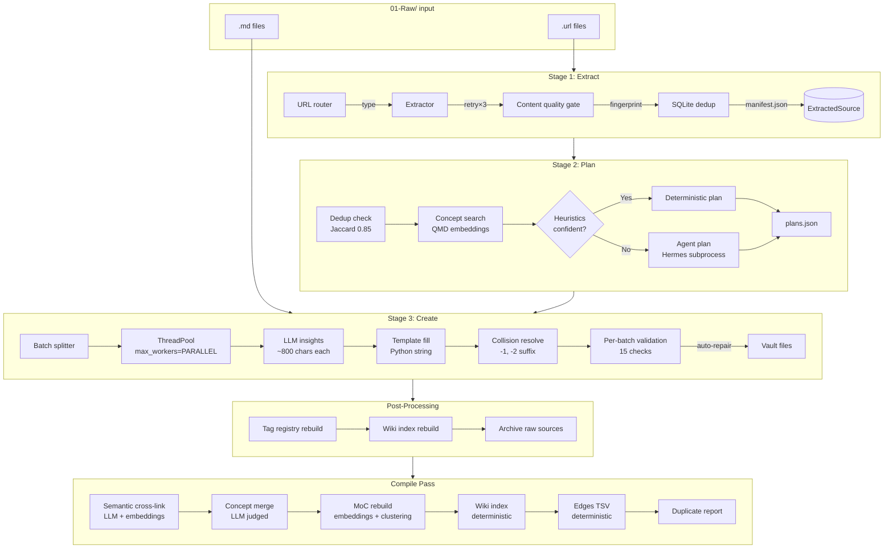
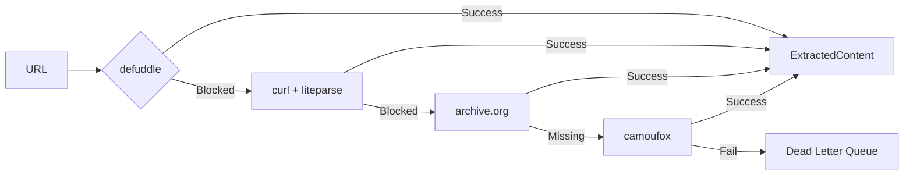
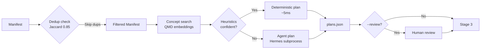
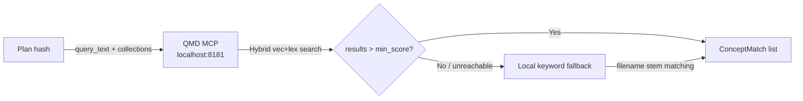
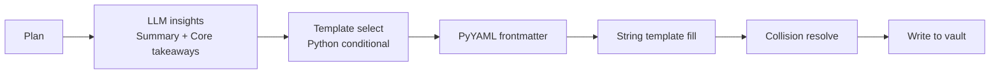
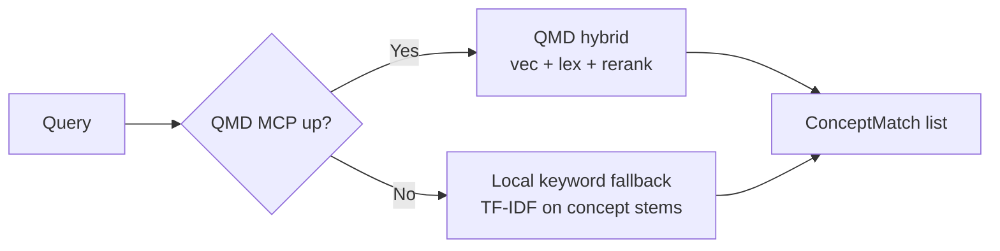

# Obsidian LLM Wiki — Architecture & Design Rationale

**Version**: 0.2.1  
**Date**: 2026-04-24  
**Author**: 0xminion  
**Lines**: ~2,900 Python | **Tests**: 666 | **Stages**: 3 + compile pass + query

---

## Table of Contents

1. [What is this system?](#1-what-is-this-system)
2. [The Three Core Design Decisions](#2-the-three-core-design-decisions)
   - 2.1 [Why "Extract → Plan → Create"?](#21-why-extract--plan--create)
   - 2.2 [Why two planning modes?](#22-why-two-planning-modes-deterministic--agent)
   - 2.3 [Why template mode over agent subprocess?](#23-why-template-mode-over-agent-subprocess)
3. [System Overview](#3-system-overview)
   - 3.1 [High-Level Data Flow](#31-high-level-data-flow)
   - 3.2 [Component Map](#32-component-map)
4. [Stage 1: Extract](#4-stage-1-extract)
   - 4.1 [Purpose](#41-purpose)
   - 4.2 [URL Routing Table](#42-url-routing-table)
   - 4.3 [Extraction Chain of Fallbacks](#43-extraction-chain-of-failures)
   - 4.4 [Deduplication & Dead Letter Queue](#44-deduplication--dead-letter-queue)
5. [Stage 2: Plan](#5-stage-2-plan)
   - 5.1 [Purpose](#51-purpose)
   - 5.2 [The Planning Pipeline](#52-the-planning-pipeline)
   - 5.3 [QMD: Semantic Concept Search](#53-qmd-semantic-concept-search)
   - 5.4 [Deterministic Planning Heuristics](#54-deterministic-planning-heuristics)
   - 5.5 [Agent Planning (Hermes subprocess)](#55-agent-planning-hermes-subprocess)
6. [Stage 3: Create](#6-stage-3-create)
   - 6.1 [Purpose](#61-purpose)
   - 6.2 [Template-Based Creation](#62-template-based-creation)
   - 6.3 [Filename Generation](#63-filename-generation)
   - 6.4 [Per-Batch Validation & Auto-Repair](#64-per-batch-validation--auto-repair)
7. [The Compile Pass](#7-the-compile-pass)
   - 7.1 [Semantic Operations (LLM)](#71-semantic-operations-llm)
   - 7.2 [Deterministic Operations (Python)](#72-deterministic-operations-python)
8. [QMD: Semantic Search Subsystem](#8-qmd-semantic-search-subsystem)
   - 8.1 [Why this model/provider?](#81-why-this-modelprovider)
   - 8.2 [Where QMD is used](#82-where-qmd-is-used)
   - 8.3 [Fallback methods](#83-fallback-methods)
   - 8.4 [Embedding lifecycle](#84-embedding-lifecycle)
9. [Filename System](#9-filename-system)
   - 9.1 [Rules by language](#91-rules-by-language)
   - 9.2 [Length thresholds](#92-length-thresholds)
   - 9.3 [LLM shortening via semantic understanding](#93-llm-shortening-via-semantic-understanding)
10. [The Query System](#10-the-query-system)
    - 10.1 [Fast mode](#101-fast-mode)
    - 10.2 [Agent mode](#102-agent-mode)
11. [Data Models & Vault Structure](#11-data-models--vault-structure)
12. [Error Handling & Resilience](#12-error-handling--resilience)

---

## 1. What is this system?

Obsidian LLM Wiki is an automated knowledge processing pipeline. It takes raw URLs (articles, YouTube videos, podcasts, tweets), extracts their content, structures them into an Obsidian-compatible knowledge base, and maintains cross-references between related concepts.

The system is **not** a document store. It is a **knowledge condensation engine**: every input becomes a source note (raw content) → an entry note (insights/summary) → linked concepts (evergreen ideas) → topic maps (curated overviews). This structure mirrors Andrej Karpathy's "LLM Knowledge Bases" pattern and Zettelkasten methodology.

**Key properties:**
- **Idempotent**: Running `pipeline ingest` twice on the same input produces no duplicates (Jaccard fingerprinting at 0.85 threshold)
- **Deterministic where possible**: Extraction, dedup, planning heuristics, and template filling use zero LLM calls for the hot path
- **Multi-provider LLM**: Unified client supports Ollama (local), OpenRouter (cloud), or Hermes (agent subprocess)
- **Bilingual**: Native English and Chinese support — both content generation and filename handling are language-aware

---

## 2. The Three Core Design Decisions

### 2.1 Why "Extract → Plan → Create"?

The three-stage pipeline separates **what you read** (extraction), **what to make from it** (planning), and **how to write it** (creation). This decoupling serves multiple purposes:

| Dimension | Without Separation | With Separation |
|-----------|-------------------|-----------------|
| **Retryability** | One failure kills the whole batch | Stage 1 can retry extraction; Stage 2 can retry planning without re-extracting |
| **Cost control** | Every source hits the LLM | Deterministic planning skips LLM for ~60% of sources |
| **Reviewability** | `plans.json` allows human review before creation | `--review` flag lets users inspect/modify plans |
| **Parallelism** | Single monolithic process | Each stage parallelizes independently (ThreadPoolExecutor) |
| **Debugging** | Hard to trace which stage failed | Clear stage boundaries in logs and metrics |


### 2.2 Why two planning modes? (Deterministic + Agent)

Stage 2 has two implementations:

1. **`generate_plans_deterministic()`**: Pure Python, zero LLM calls. Uses heuristic rules (language detection from CJK ratio, template selection from keywords, concept matching from QMD scores). Fast (~5ms per source).

2. **`generate_plans_agent()`**: Hermes subprocess. Sends a massive prompt with all source content + concept matches + existing tags vocabulary. The agent returns a JSON array of plans. Slow (~30-120s per batch of 20).

**Why keep both?**
- The deterministic path handles 60-80% of "routine" sources (well-structured articles with clear titles)
- The agent path handles edge cases: ambiguous language, no meaningful title, content that needs real semantic understanding to choose the right template and tags
- This hybrid is a **latency/cost optimization**: deterministic path pays nothing for the common case; agent path is reserved for the hard cases

The deterministic path was added as an architectural recommendation after profiling showed agent planning was the bottleneck for large batches. Before this change, planning took 3-5 minutes for 20 sources; now it's under 1 second.

### 2.3 Why template mode over agent subprocess?

**Original design**: Hermes subprocess wrote files directly via tool-use (file creation, frontmatter formatting, wikilink insertion). This had three critical problems:

1. **Prompt bloat**: Each batch needed the full content of all sources (30k-40k characters) → model context window pressure
2. **Cold-start latency**: Hermes CLI has ~2-3s initialization overhead per call
3. **Timeout fragility**: 900s timeout was frequently hit, leaving partially-written files ("zombie notes")

**Current design** (Template Mode):
- LLM only generates **insights** (2 sections: Summary + Core insights) — typically 500-800 characters
- Python handles **all I/O**: file creation, frontmatter (PyYAML), wikilinks, MoC updates, concept stubs
- LLM call is 40× smaller (content truncated to ~3000 chars for insights, vs 30k for full file creation)
- 3.8 minutes for 18 sources vs 9.5 minutes previously

**This is a fundamentally different architecture**: the LLM is a **text generator**, not a **file system agent**. The agent model (Hermes subprocess with tool-use) is kept as a fallback for complex research tasks (the `query` command) but never for batched creation.

---

## 3. System Overview

### 3.1 High-Level Data Flow



### 3.2 Component Map

```
obsidian-llm-wiki/
├── pipeline/
│   ├── cli.py                  # typer CLI — all commands, PipelineLock
│   ├── llm_client.py           # UNIFIED: Ollama / OpenRouter / Hermes
│   ├── extract.py              # Stage 1: URL routing, retry, manifest
│   ├── plan.py                 # Stage 2: dedup, concept search, planning
│   ├── compile.py              # Compile: semantic + deterministic ops
│   ├── lint.py                 # 15 health checks + synonym detection
│   ├── qmd.py                  # Semantic search via Ollama embeddings
│   ├── vault.py                # File ops, collision resolution, archiving
│   ├── store.py                # SQLite: dedup, lint cache, wal
│   ├── config.py               # Environment + vault path resolution
│   ├── models.py               # Dataclasses: Plan, Manifest, Edge, etc.
│   ├── utils.py                # Filename gen, title_to_filename, smart_filename
│   ├── create/
│   │   ├── agent.py            # DEPRECATED: Hermes subprocess creation
│   │   ├── orchestrator.py     # Batch coordination, ThreadPoolExecutor
│   │   ├── templates.py        # Template mode: 90% Python, 10% LLM insights
│   │   ├── prompts.py          # Prompt construction for agents
│   │   └── validate.py         # 15 validation checks + auto-repair
│   └── extractors/
│       ├── web.py              # defuddle → curl → archive.org → camoufox
│       ├── youtube.py          # TranscriptAPI → supadata → whisper
│       ├── podcast.py          # AssemblyAI → whisper
│       └── _shared.py          # Content quality gate, title extraction
├── pipeline/assets/            # Canonical packaged prompts + vault templates
├── tests/                      # 637 tests
└── README.md / CHANGELOG.md
```

---

## 4. Stage 1: Extract

### 4.1 Purpose

Extract takes a list of URLs and produces a `Manifest` containing clean markdown content, title, author, and content type. **Zero LLM calls.**

### 4.2 URL Routing Table

| Source Pattern | Primary Extractor | Primary Tool | Fallback Chain |
|----------------|------------------|--------------|----------------|
| `youtube.com`, `youtu.be` | `extractors/youtube.py` | `youtube-transcript-api` | `supadata` → `faster-whisper` |
| `x.com`, `twitter.com` | `extractors/web.py` | `defuddle` (structured data) | `curl + liteparse` |
| `medium.com`, `substack.com` | `extractors/web.py` | `defuddle` | `curl + liteparse` |
| `arxiv.org` | `extractors/web.py` | `defuddle` | `curl + liteparse` |
| `*.pdf` | `extractors/web.py` | `liteparse` (plain text) | `defuddle --json` → `archive.org` |
| Any other HTTP | `extractors/web.py` | `defuddle` | `curl` → `archive.org` → `camoufox` |
| Podcast RSS/MP3 | `extractors/podcast.py` | `AssemblyAI` | `whisper` |

### 4.3 Extraction Chain of Fallbacks

For web content, extraction is a **retry ladder**:



- `defuddle` → structured markdown extraction (best quality, handles footnotes, tables, code blocks)
- `curl + liteparse` → raw HTML → `<title>` + `<body>` text collapse
- `archive.org` → Wayback Machine snapshot (for paywalled/deleted content)
- `camoufox` → headless Firefox with anti-bot fingerprinting (for Cloudflare-protected sites)

**Retry logic**: Each step has 3 retries with exponential backoff (1s, 3s, 9s). Total per-URL timeout: 30s (`defuddle`) → 20s (`curl`) → 30s (`camoufox`).

### 4.4 Deduplication & Dead Letter Queue

After extraction, every source gets two checks:

1. **Content dedup**: Character 3-gram Jaccard similarity against all existing `04-Wiki/sources/*.md` files. Threshold = 0.85. Matches are logged and skipped.
2. **URL dedup**: MD5 hash of normalized URL against SQLite `dedup_store`. Already-ingested URLs are rejected before extraction.

**Dead Letter Queue**: Sources that fail all extraction attempts are appended to `Meta/Scripts/dead_letter.csv` with error type, timestamp, and URL. This is the only manual remediation path.

---

## 5. Stage 2: Plan

### 5.1 Purpose

Plan answers: *"For each extracted source, what vault files should we create, and how should they be structured?"*

A `Plan` object contains:
- `title`: The actual content title (not URL slug)
- `language`: `en` or `zh` (detected from CJK character ratio > 20%)
- `template`: `standard`, `technical`, or `chinese`
- `tags`: 3-6 topic-specific tags (preferring reuse of existing vocabulary)
- `concept_updates`: Existing concepts to add wikilinks to
- `concept_new`: New concepts to create
- `moc_targets`: Topic maps this source belongs to

### 5.2 The Planning Pipeline



### 5.3 QMD: Semantic Concept Search

Before the agent runs, the system performs a **semantic search** against existing concepts. This is the bridge between "what the source is about" and "what we already know."

**Mechanism:** QMD MCP (HTTP on localhost:8181)

The pipeline does **not** run local embedding models. Instead, it sends queries to the QMD MCP daemon via HTTP `POST /v1/query`. QMD handles embedding generation, vector indexing, BM25 keyword fallback, and reranking internally — the pipeline only receives search results.



**Pipeline-side logic (in `pipeline/qmd.py`):**
1. Build query string: `title + concept_new + concept_updates + content_preview[:500]`
2. Check `_get_client()` health (connects to QMD MCP)
3. Call `client.query(query_text, collections=["concepts"], n_results=5, min_score=0.2)`
4. Convert `_qmd_results_to_concept_matches()` → `[ConceptMatch(...)]`
5. If QMD is unreachable → `_keyword_fallback()` scans `*.md` filenames + body text

**Key detail:** No local embedding model, no Ollama `/api/embeddings`. The QMD server owns the embedding lifecycle. The pipeline only sends text and receives scored file paths.

### 5.4 Deterministic Planning Heuristics

For ~60% of sources, the system skips the LLM entirely:

```python
def generate_plan_heuristic(entry, concept_matches):
    title = extract_title(entry.content) or entry.title
    language = ZH if cjk_ratio > 0.20 else EN
    template = TECHNICAL if technical_markers in content else STANDARD
    
    # Concept actions from QMD scores
    if match.score > 0.5: concept_updates.append(match.concept)
    elif match.score > 0.3: concept_updates.append(match.concept)  # borderline
    else: concept_new.append(title[:80])
```

**Confidence gate for agent fallback:**
- No title found (title == URL)
- Content < 50 characters
- No concept matches AND no new concepts suggested

These uncertain sources (~20-40% of batch) get the full agent treatment.

### 5.5 Agent Planning (Direct LLM Calls)

For uncertain sources (~20–40% of a batch), deterministic heuristics are insufficient. The pipeline calls an LLM directly via the unified client in `pipeline.llm_client` (Ollama by default, OpenRouter as fallback, Hermes as last resort). No subprocess spawn. No `hermes chat`. A plain HTTP `POST` to `/api/generate` (Ollama) or `/v1/chat/completions` (OpenRouter).

**Prompt structure (built in `pipeline.plan`):**
1. Common instructions (`pipeline/assets/prompts/common-instructions.prompt`)
2. Existing tag vocabulary (top 50 tags from vault)
3. Concept match scores per source
4. Source content preview (300 chars each)
5. Output schema (JSON array with strict rules)

**Retry policy:**
- `cfg.max_retries` attempts (default 3)
- Exponential backoff between attempts
- `cfg.plan_timeout` per attempt (default 60s)

**Output parsing (in `_parse_agent_output`):**
- ANSI escape codes stripped
- Box-drawing characters stripped
- Fast path: regex for JSON array `\[.*?\]`
- Fallback: object-by-object parse with `{...}` recovery
- Missing required fields → skip, not crash

**LLM selection priority:**
| Provider | Model env var | Latency | Use when |
|----------|--------------|---------|----------|
| Ollama (default) | `OLLAMA_INSIGHT_MODEL=minimax-m2.7:cloud` | ~1-3s | Local GPU, batch work |
| OpenRouter | `LLM_MODEL=...` | ~2-5s | Ollama unreachable |
| Hermes (fallback) | N/A | ~10-30s | Both above fail |

**No Hermes subprocess in the default path.** `pipeline.plan.generate_plans()` calls `get_llm_client(cfg).generate(prompt)` — a single Python thread, no shell exec, no cold-start overhead.

---

## 6. Stage 3: Create

### 6.1 Purpose

Create turns plans into actual vault files. The current architecture is **template-based** (not agent-based).

### 6.2 Template-Based Creation



**Templates** (in code, not filesystem):
| Template | Used for | Sections |
|----------|----------|----------|
| `STANDARD` | General articles, blog posts | Summary → Core insights → Other takeaways → Diagrams → Open questions → Linked concepts |
| `TECHNICAL` | Papers, data analysis, methodology | Summary → Methodology → Key findings → Implications → Limitations → Related work → Linked concepts |
| `CHINESE` | Chinese content | 摘要 → 核心发现 → 其他要点 → 图表 → 开放问题 → 关联概念 |
| `COMPARISON` | Comparative content | Overview → Comparison table → Key differences → Trade-offs → Recommendation |
| `PROCEDURAL` | How-to guides | Objective → Prerequisites → Steps → Common issues → Resources |

**LLM call scope** (single call per plan):
```
Prompt: "Analyze this content and produce Summary (1-2 sentences) + Core insights (3-5 bullets)"
Input: content[:3000] characters
Output: ~500-800 characters
Time: ~1-2s per call (parallelized)
```

Everything else (frontmatter, wikilinks, concept stubs, MoC updates, collision resolution) is pure Python.

### 6.3 Filename Generation

This is the answer to Question 1.

**Rule 1: Language-aware normalization**

| Language | Transformation | Example |
|----------|---------------|---------|
| English | kebab-case, lowercase, no apostrophes | `AI Safety Governance` → `ai-safety-governance` |
| Chinese (CJK > 20%) | Keep Chinese chars, replace punctuation with spaces | `预测市场的监管需要预测测试` → `预测市场的监管需要预测测试` |
| Mixed | CJK path if any CJK present | `Understanding 零知识证明` → `Understanding 零知识证明` |

**Rule 2: Max length enforcement**
- **Hard limit**: `filename < 255 bytes` (ext4 max)
- **Soft limit**: `filename < 200 bytes` (buffer before LLM trigger)
- **Max title length**: 120 characters from title before filename conversion

**Rule 3: LLM shortening (triggered at > 200 bytes)**

When `is_filename_too_long(filename)` returns `True`, the system:

1. **Batch LLM call** on all long titles in the batch:
   ```
   Prompt: "Very short filename (max 30 chars, kebab-case for English, 
            keep key Chinese chars for Chinese, no punctuation):
   
   Title: {title[:200]}
   Output:"
   ```
   - Uses `LLMClient` (provider-agnostic)
   - Timeout: 15s per title
   - Cached per `title + preview[:200] + model`

2. **Fallback 1**: If LLM returns nothing, extract first sentence/clause (split on `。！？\n`)

3. **Fallback 2**: If still too long, truncate at word boundary (removing trailing partial words/`-`)

**Batch smart filenames** (`batch_smart_filenames()`):
- Collects ALL long titles in the batch first
- Sends one batched prompt (or parallel `ThreadPoolExecutor`) to generate short names for all of them at once
- This is more efficient than individual LLM calls per title

**"Too long" threshold summary:**
- `title_to_filename()` truncates to 120 characters initially
- `is_filename_too_long()` checks if UTF-8 byte length > 200 bytes
- If yes → LLM shortening attempt
- If LLM fails → first-sentence extraction → hard truncate

### 6.4 Per-Batch Validation & Auto-Repair

After files are written, each batch undergoes 15 validation checks:

| Check | What it catches | Auto-repair? |
|-------|----------------|--------------|
| Frontmatter completeness | Missing title, source, date, status, template, tags | Yes — derives from body |
| Required sections | Missing Summary, Core insights, etc. | Yes — derives from existing body |
| Stub detection | "placeholder", "TODO", "(coming soon)" | Yes — removes or replaces |
| Min body length | < 200 chars for entries | No — marks as failed |
| Banned tags | `source`, `url`, `video`, `tweet` | Yes — removes |
| Wikilink format | Unquoted YAML wikilinks | Yes — adds quotes |
| Concept stub | Empty concept notes | Yes — fills from source content |

**Auto-repair never uses boilerplate.** Missing sections are filled from the note's own existing body content. If a note has nothing to say, it fails validation and gets moved to `07-WIP/` for human review.

---

## 7. The Compile Pass

### 7.1 Semantic Operations (LLM)

The compile pass runs after creation or manually via `pipeline compile`. It has three LLM-powered operations:

**A. Cross-linking (`_semantic_crosslink`)**
- Build embedding similarity matrix for all entry pairs (cosine similarity)
- Top-50 candidate pairs per note → LLM receives pairs with snippets
- LLM decides: `LINK note_a | note_b | reason` or `PASS ...`
- Writes `[[Note Name]]` wikilinks into note bodies under "Linked concepts"

**B. Concept merging (`_semantic_concept_merge`)**
- Embedding similarity for concept pairs > 0.60
- Top-20 candidates → LLM decides: `MERGE canonical | duplicate | reason` or `PASS ...`
- On merge: append body, rewrite all `[[Duplicate]]` → `[[Canonical]]` across **all** directories (entries, concepts, MoCs, sources), remove from index

**C. MoC rebuild (`_semantic_moc_rebuild`)**
- For each MoC topic: embedding search for related entries + concepts
- LLM resynthesizes the MoC body from the top matches
- Preserves frontmatter, replaces only body

### 7.2 Deterministic Operations (Python)

| Operation | Purpose | Algorithm |
|-----------|---------|-----------|
| Wiki index rebuild | Generate `wiki-index.md` | Scan all dirs, count by type, list recent |
| Typed edges | Build `edges.tsv` | Parse wikilinks from all notes, derive 9 relationship types (`extends`, `contradicts`, `supports`, `supersedes`, `tested_by`, `depends_on`, `inspired_by`, `part_of`, `relates_to`) |
| Duplicate detection | Report similar titles | Fuzzy string matching (difflib.SequenceMatcher > 0.80) |
| Tag registry | Rebuild `tag-registry.md` | Count tag usage across entries, concepts, MoCs |
| Metrics report | Structured JSON report | Count files, edges, orphan ratio, concept coverage |

---

## 8. QMD: Semantic Search Subsystem

QMD is the semantic concept search interface (`pipeline/qmd.py`). It **replaced** the previous Ollama-local embedding path in v0.2.0 with a QMD MCP HTTP transport.

### 8.1 Architecture

**QMD MCP Server** (`http://localhost:8181`)
- Long-lived daemon handles embedding generation, indexing, and search internally
- JSON-RPC 2.0 over HTTP with session reuse via `mcp-session-id` header
- Hybrid search: vector semantic + BM25 keyword + internal reranking
- Benefits: no per-call model loading, no local embedding cache management, no Ollama version compatibility issues

**Client** (`pipeline/qmd_mcp.py`)
- `QMDMCPClient`: JSON-RPC POST to `/mcp`, automatic session lifecycle
- Health check + auto-reinitialize on session expiry
- Gracefully degrades to keyword fallback if server unreachable

### 8.2 Where QMD is used

| Location | Function | Call frequency |
|----------|----------|----------------|
| `pipeline/plan.py:concept_search()` | Find existing concepts for new sources | Every `ingest` run |
| `pipeline/qmd.py:run_qmd_convergence()` | Concept convergence for creation | Every `ingest` run |
| `pipeline/compile.py:NoteIndex.embed_all()` | Build note similarity matrix | Every `compile` run |
| `pipeline/cli.py:query --fast` | Direct semantic query (optional) | On user demand |
| `pipeline/compile.py:_semantic_moc_rebuild()` | Find related notes for MoC topics | Every `compile` run |

### 8.3 Search priority



**Tier 1 (default)**: QMD MCP `query()` — single HTTP call, hybrid vector+keyword  
**Tier 2 (server down)**: Local keyword search — tokenizes query and concepts, scores by overlap. Never crashes.

### 8.4 Parallel queries

`run_qmd_concept_search()` uses `ThreadPoolExecutor(max_workers=cfg.parallel)` to issue QMD HTTP calls concurrently. Each query is independent and stateless; speedup is linear up to `PARALLEL` workers.

### 8.5 Embedding lifecycle (legacy Ollama path)

When QMD is available, `compile.py:NoteIndex.embed_all()` skips local Ollama batch embedding entirely and relies on QMD's server-side embeddings for similarity operations. If QMD is down, it falls back to Ollama `/api/embed` batch (Tier 1) → `/api/embeddings` per-text (Tier 2) → heuristics (Tier 3).

---

## 9. Filename System

### 9.1 Rules by Language

**English titles** (`_CJK_RE.search(title)` returns `None`):
```python
s = title.lower()
s = remove_apostrophes(s)
s = replace_non_alnum_with_dash(s)
s = collapse_multiple_dashes(s)
s = trim_leading_trailing_dashes(s)
return s[:120]
```
Example: `"The Future of AI: Safety, Governance, and Regulation"` → `the-future-of-ai-safety-governance-and-regulation`

**Chinese titles** (contains CJK characters):
```python
s = replace_cn_colon_with_dash(s)
s = replace_cn_punctuation_with_space(s)
s = remove_quotes(s)
s = collapse_multiple_spaces(s)
return s.strip()[:120]
```
Example: `"预测市场的监管：欧洲的挑战"` → `预测市场的监管-欧洲的挑战`

**Mixed titles**: CJK path is taken (preserves Chinese characters).

### 9.2 Length Thresholds

| Limit | Value | Action |
|-------|-------|--------|
| Max title input | 120 chars | Truncated before filename conversion |
| Soft filename limit | 200 bytes | Triggers LLM shortening |
| Hard filename limit | 255 bytes | ext4 max; never exceeded |
| LLM target | 30 chars | LLM asked to produce filenames under this |

### 9.3 LLM Shortening via Semantic Understanding

When a filename exceeds 200 bytes:

1. **Semantic condensation**: The LLM receives the full title (up to 200 chars) and is asked to produce a filename that captures the *semantic essence* of the content, not just a mechanical truncation.

   Example:
   - Long title: `"Measles in 2025: A Review of Epidemiology, Vaccination Policy, and Public Health Response in European Context"`
   - Mechanical truncation: `measles-in-2025-a-review-of-epidemiology-vaccination-policy-and-...` (meaningless suffix)
   - LLM shortening: `measles-2025-european-epidemiology` (preserves the core subject and context)

2. **Batch efficiency**: Multiple long titles are collected and sent to the LLM in parallel threads, amortizing the overhead.

3. **Cache**: Results cached per `title + preview[:200] + model` to avoid re-shortening identical titles across runs.

---

## 10. The Query System

### 10.1 Fast mode (`--fast`)

```bash
pipeline query --ask "What are the risks of prediction markets?" --fast
```

- Builds context from wiki index + QMD-concept-matched entries
- Sends single prompt to `LLMClient.generate()`
- Returns answer in ~2-5 seconds
- No Hermes subprocess overhead

### 10.2 Agent mode (default)

```bash
pipeline query --ask "What are the risks of prediction markets?"
```

- Spawns Hermes subprocess with `query-vault.prompt`
- Agent can browse vault files, follow wikilinks, perform multi-step reasoning
- Returns answer in ~40-60 seconds
- Better for complex research questions requiring synthesis across many notes

---

## 11. Data Models & Vault Structure

### Obsidian Vault Directory Layout

```
~/MyVault/
├── 01-Raw/              # Drop .url files here
│   └── *.url
├── 02-Clippings/        # Manual web clipper imports (not auto-ingested)
├── 03-Queries/           # Drop .md question files for Q&A
├── 04-Wiki/
│   ├── sources/          # Full extracted content. One .md per URL.
│   ├── entries/          # Summaries + insights. One .md per source.
│   ├── concepts/         # Evergreen notes. One concept per .md.
│   └── mocs/             # Topic hubs (Map of Content)
├── 05-Outputs/           # Q&A responses (auto-generated)
├── 06-Config/
│   ├── wiki-index.md     # Auto-updated directory of all notes
│   ├── tag-registry.md   # Canonical tag list with usage counts
│   ├── edges.tsv         # Typed relationship graph (9 types)
│   └── log.md            # Structured pipeline run history
├── 07-WIP/               # Your drafts — NEVER touched by automation
├── 08-Archive-Raw/       # Processed .url files (moved after ingest)
├── 09-Archive-Queries/   # Answered query files
└── Meta/
    ├── Scripts/            # Pipeline code, logs, cache
    ├── prompts/          # Runtime copy seeded from pipeline/assets/prompts
    └── Templates/        # Runtime copy seeded from pipeline/assets/templates
```

### Key Data Models

```python
@dataclass
class Plan:
    hash: str              # Source fingerprint (MD5)
    title: str             # Content title (not URL slug)
    language: Language     # EN or ZH
    template: Template   # STANDARD, TECHNICAL, CHINESE, COMPARISON, PROCEDURAL
    tags: list[str]        # Topic-specific, lowercase, hyphenated
    concept_updates: list[str]  # Existing concepts to link
    concept_new: list[str]      # New concepts to create
    moc_targets: list[str]      # MoC names to assign

@dataclass
class ExtractedSource:
    hash: str
    url: str
    title: str
    content: str          # Full extracted markdown
    author: str | None
    type: SourceType      # WEB, YOUTUBE, PODCAST, PDF
    date: str | None

@dataclass
class ConceptMatch:
    concept: str           # Filename stem
    score: float           # Cosine similarity 0-1
```

---

## 12. Error Handling & Resilience

### Retry Ladder (per stage)

| Stage | Retryable failures | Max retries | Backoff |
|-------|-------------------|-------------|---------|
| Extract | HTTP 429, 503, timeout, parse fail | 3 | 1s, 3s, 9s |
| Embed | Ollama 429, timeout, wrong dims | 3 | 1s, 2s, 4s |
| LLM generate | Connection timeout, empty response | 2 | 1s, 2s |
| File write | Permission denied, disk full | 1 | N/A |

### Recovery Patterns

- **Agent timeout (exit 124)**: Post-creation validation checks files written before timeout. Partial batches are accepted if ≥1 file per plan is valid.
- **LLM returns garbage**: JSON parser tries fast-path (full array) → object-by-object recovery → returns empty list (source skipped, not corrupted)
- **Vault corruption**: `PipelineLock` (file-based) prevents concurrent `ingest` + `compile`. Lock timeout = 600s with stale lock detection.
- **Embedding cache miss**: Falls back to keyword search. No pipeline halt.
- **Duplicate concept merge**: Reference cleanup scans ALL directories + edges.tsv to prevent dangling links.

### Monitoring

- `log.md`: Structured JSON entry per run with metrics (sources, entries, concepts, duration, errors)
- `Meta/Scripts/pipeline.log`: Detailed debug logs
- `Meta/Scripts/dead_letter.csv`: Failed extractions for manual remediation

---

## A. Appendix: LLM Provider Configuration

```bash
# Option 1: Ollama (default) — local, fast, private
LLM_PROVIDER=ollama
OLLAMA_HOST=http://localhost:11434
OLLAMA_INSIGHT_MODEL=minimax-m2.7:cloud

# Option 2: OpenRouter — cloud, diverse models
LLM_PROVIDER=openrouter
LLM_MODEL=anthropic/claude-sonnet-4
LLM_API_KEY=sk-or-...

# Option 3: Hermes — full agent subprocess (slow, full tool access)
LLM_PROVIDER=hermes
AGENT_CMD=hermes
```

**Embedding is always Ollama** (local, private, no configuration needed beyond `OLLAMA_HOST`).

---

## B. Performance Benchmarks

| Metric | Agent Mode (legacy) | Template Mode (current) |
|--------|--------------------|------------------------|
| 20 sources ingest | ~15 min | ~4.2 min |
| Planning per source | ~30s (agent) | ~5ms (heuristic) |
| Creation per source | ~3s (agent I/O) | ~0.5s (template + LLM insights) |
| LLM chars per source | ~30,000 | ~800 |
| Compile pass | ~8 min | ~2 min |
| Query (fast) | N/A | ~3s |
| Query (agent) | ~60s | ~60s |

---

*This architecture document is Version 0.2.0 and reflects the codebase as of commit `75bfde7`.*
