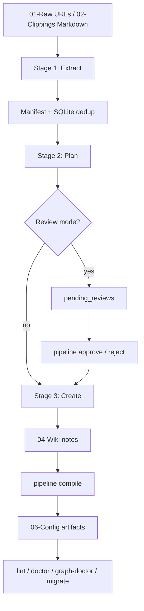
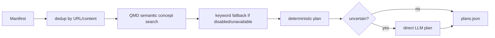

# Obsidian LLM Wiki — Architecture

**Version:** 0.3.1  
**Date:** 2026-04-29  
**Pipeline code:** ~16,200 Python lines in `pipeline/`  
**Console script:** `pipeline = pipeline.cli:app`

## Design thesis

Obsidian LLM Wiki is a local-first knowledge pipeline. It converts raw inputs into an Obsidian-native wiki while keeping the filesystem, graph, and release gates deterministic.

The central architectural decision is blunt and important:

> LLMs provide bounded semantic judgment. Python owns paths, frontmatter, validation, graph artifacts, migrations, and writes.

That split is what makes the project auditable. Letting an agent directly write arbitrary notes was cute until it became a data-integrity problem. The current design treats the LLM as a component, not a sysadmin with vibes.

## System overview



## Component map

```text
pipeline/
├── cli/
│   ├── _helpers.py         shared CLI config, locking, query helpers
│   ├── __main__.py         python -m pipeline.cli entry point
│   ├── ingest.py           extract → plan → create orchestration
│   ├── compile_cmd.py      compile command wrapper
│   ├── review_cmd.py       approve/reject/review-status
│   ├── quality.py          lint, validate, doctor, config-doctor, release-check
│   └── manage.py           init, stats, tags, query, fixture, graph-doctor, migrate
├── compile/
│   ├── core.py             CompileResult, incremental state, compile orchestration
│   ├── semantic.py         cross-link, concept merge, MoC semantic operations
│   ├── structural.py       wiki-index, edges, duplicate report
│   └── watch.py            incremental watch support
├── create/
│   ├── templates.py        deterministic template creation + bounded LLM insights
│   ├── orchestrator.py     batch coordination (now thin wrapper for templates)
│   ├── validate.py         post-create validation and auto-repair
│   └── prompts.py          prompt construction from assets/prompts/
├── extractors/
│   ├── _shared.py          URL safety, curl helpers, title extraction, transcription
│   ├── web.py              web/PDF extraction fallback chain
│   ├── youtube.py          transcript APIs and canonical YouTube fallback
│   ├── twitter.py          X/Twitter extraction via defuddle direct fetch
│   └── podcast.py          RSS/audio extraction
├── lint/                   health checks, fixes, models, runner
├── assets/
│   ├── prompts/            .prompt files for content generation (loaded at runtime)
│   └── templates/          .md templates for note types (Entry, Concept, Source, MoC)
├── graph_doctor.py         graph integrity diagnostics
├── migrations.py           idempotent vault schema/assets migrations
├── fixtures.py             deterministic and adversarial fixture vaults
├── qmd.py                  QMD MCP semantic search facade
├── qmd_mcp.py              QMD MCP client, JSON-RPC, session lifecycle
├── vault.py                vault file operations, MoC/index/edge writes
├── review.py               staged review approval/rejection
├── store.py                SQLite content store, review queue, cache
├── config.py               environment and vault path resolution
├── llm_client.py           Ollama/OpenRouter/Hermes unified LLM abstraction
└── utils.py                filename/path safety, prompt loading, shared helpers
```

### Prompt system (new in 0.3.1)

All LLM prompts now live in `pipeline/assets/prompts/` as `.prompt` files:
- `insight-generation.prompt` — loaded by `templates._load_insight_prompt()`
- `entry-structure.prompt` — loaded by `prompts._load_prompt()`
- `concept-structure.prompt` — loaded by `prompts._load_prompt()`
- `batch-create.prompt` — legacy, replaced by deterministic templates
- `compile-pass.prompt` — used by `compile/core.py`

Prompts are loaded via `utils.load_prompt(name, prompts_dir)` and use `{{VAR}}` substitution.

### Removed components (0.3.1)

- `pipeline/create/agent.py` — Hermes subprocess creation path removed (deprecated since 0.3.0)
- `--agent` flag from `ingest` CLI — no longer supported
- `create_all()` from `pipeline/create/orchestrator.py` — superseded by `create_file_templates()`

## Stage 1: Extract

Stage 1 is deterministic. It produces `ExtractedSource` entries and a `Manifest`.

| Input | Primary path | Fallback path |
|---|---|---|
| Web article / X / PDF | defuddle / liteparse | curl extraction → archive.org → camoufox where available |
| YouTube | transcript API | Supadata → canonical `yt-dlp` URL → faster-whisper |
| Podcast | RSS/audio + AssemblyAI | local whisper |
| Markdown clipping | direct ingest from `02-Clippings/` | none |

### Network boundary model

The extractor layer is security-sensitive because it touches arbitrary URLs.

Controls:

1. URLs must parse as `http`/`https`.
2. Embedded credentials are rejected.
3. localhost, `.localhost`, private, loopback, link-local, multicast, reserved, and unspecified IP targets are rejected.
4. Weird IPv4 encodings accepted by curl are normalized and checked.
5. DNS resolution is checked before fetch.
6. curl calls add `--resolve host:port:public_ip` and abort if a safe public pin cannot be established.
7. Secret headers are passed through stdin curl config, not argv.
8. YouTube routing validates allowed hostnames and then canonicalizes to `https://www.youtube.com/watch?v={video_id}`.

## Stage 2: Plan

Planning decides note shape, tags, concepts, and MoC targets.



QMD MCP is optional. `USE_QMD_MCP=false|0|no|off` disables client construction completely. If QMD is unavailable, local keyword fallback keeps the pipeline usable.

## Stage 3: Create

Creation is template-first, deterministic, and path-safe. **LLM calls are bounded and fail gracefully.**

Responsibilities owned by Python:

- choose templates;
- build YAML/frontmatter safely;
- generate wikilinks and aliases;
- create source/entry/concept/MoC files;
- ensure entry/source stems are distinct;
- handle collisions;
- validate batch output;
- update tag registry, wiki index, and MoC membership.

Responsibilities allowed for LLM:

- bounded entry insight text (Summary + Core insights only);
- filename shortening suggestions that are re-sanitized;
- semantic judgment during compile.

### Insight generation flow

```
_load_insight_prompt() → load from assets/prompts/insight-generation.prompt
     ↓
{{VAR}} substitution (language-aware)
     ↓
LLMClient.generate_structured(prompt, schema=InsightOutput)
     ↓ (if structured fails)
LLMClient.generate(prompt) [raw text]
     ↓ (if LLM fails)
deterministic fallback: extract first paragraph as summary,
                       first sentences of next paragraphs as bullets
```

### Filename and path boundary

All note identifiers pass through `safe_note_stem()` and write targets pass through containment checks.

Important invariants:

- `/`, `\`, `..`, drive prefixes, control chars, and path-like LLM output do not carry path semantics.
- `safe_note_path(base_dir, stem)` always resolves under `base_dir`.
- `assert_path_within(base_dir, target)` is the last line of defense before write.
- Review rows are not trusted just because they came from SQLite.

## Review workflow

`pipeline ingest --review` stages plans in `pending_reviews`. Approval is designed to prevent corrupt half-writes.

Approval algorithm:

1. Load pending rows grouped by `plan_hash`.
2. Map `file_type` to the allowed vault collection.
3. Validate paths with containment checks.
4. Validate all staged content before final writes.
5. Write temp files.
6. Atomically replace final files.
7. If a later replace fails, roll back already-replaced files.
8. Mark rows approved only after the plan succeeds.

This is not database-perfect distributed transactionality, but it is the right local-filesystem compromise: fail closed, write nothing on validation failure, and roll back final replace failures.

## Compile pass

`pipeline compile` has semantic and deterministic halves.

### Semantic half

- Cross-link candidate generation uses tags, title tokens, and bounded fallback windows before expensive pair scoring.
- QMD embeddings are consumed when available.
- Empty LLM output when candidates exist is degraded/failure, not success.
- `CompileResult` exposes:
  - `semantic_status`
  - `semantic_degraded_reason`
  - counts for crosslinks, merges, MoC updates, edges, duplicates.

### Deterministic half

- `wiki-index.md` rebuild.
- `edges.tsv` rebuild from resolvable wikilinks and provenance links.
- duplicate report rewrite, including zero-duplicate state.
- compile log/report write.
- edge cache invalidation after direct edge rewrites.

## Graph model

Graph nodes are Obsidian note stems from four collections:

- `04-Wiki/sources`
- `04-Wiki/entries`
- `04-Wiki/concepts`
- `04-Wiki/mocs`

Typed edges are stored in `06-Config/edges.tsv` as `(from, to, type, context)` rows.

Wikilinks are resolved case-insensitively against the vault filesystem. Broken wikilinks are surfaced by `lint`.

## Configuration

All provider settings are env-configurable. No code changes needed to switch providers or models.

```bash
# Choose provider: ollama | openrouter | hermes
LLM_PROVIDER=ollama

# Generation model (default: gemma4:31b-cloud)
LLM_MODEL=gemma4:31b-cloud

# Dedicated models for specific stages
OLLAMA_INSIGHT_MODEL=gemma4:31b-cloud
OLLAMA_FILENAME_MODEL=gemma4:31b-cloud
OLLAMA_PLAN_MODEL=minimax-m2.7:cloud   # smaller prompt → structured JSON reliable

# Embedding (Ollama only; kept separate from generation provider)
EMBED_MODEL=qwen3-embedding:0.6b

# QMD MCP
USE_QMD_MCP=true
QMD_MCP_URL=http://localhost:8181
```

## LLM provider abstraction

The unified `LLMClient` supports multiple backends via the same interface:

```python
from pipeline.llm_client import get_llm_client

client = get_llm_client(cfg)
text = client.generate("Summarize this article...", timeout=60)
embedding = client.embed("concept description")
batch = client.embed_batch(["text1", "text2", "text3"])
```

| Provider | Use case |
|---|---|
| Ollama | Default local inference (fast, free) |
| OpenRouter | Frontier models without subprocess overhead |
| Hermes | Legacy subprocess fallback (deprecated) |

Error handling: `generate()` swallows errors and returns `""`. `generate_or_raise()` raises `LLMGenerationError` for critical paths.

## Data flow

```
01-Raw/*.url  ──►  Stage 1: extract_all()  ──►  /tmp/obsidian-extracted-*/{hash}.json
02-Clippings/*.md  ──►  (skip Stage 1)  ──►  manifest.json

manifest.json  ──►  Stage 2: plan_sources()  ──►  /tmp/obsidian-extracted-*/plans.json

plans.json  ──►  Stage 3: create_file_templates()  ──►  04-Wiki/{sources,entries,concepts,mocs}/*.md

04-Wiki/*.md  ──►  compile_pass()  ──►  06-Config/{edges.tsv,wiki-index.md,duplicate-report.md}
```

## Changelog (0.3.1)

- **Removed `pipeline/create/agent.py`** — Hermes subprocess creation path fully removed. The `--agent` flag is no longer supported.
- **Prompt system overhaul** — All LLM prompts now load from `pipeline/assets/prompts/*.prompt` files. `_load_insight_prompt()` replaces inline hardcoded prompts.
- **Deterministic fallback chain** — If LLM insight generation fails (structured → raw → timeout), the pipeline extracts first paragraph as summary and first sentences as bullets, ensuring every source gets content.
- **Template-first creation** — `create_file_templates()` is the only creation path. No more batch agent mode.
- **Bilingual concept notes** — `_generate_concept_template()` produces `## English` section for non-Chinese content, with `title_en:` frontmatter.
- **Evergreen concept format** — Concepts use `status: evergreen`, bilingual headings, and flowing prose in Context sections.
- **Insight depth** — Prompt explicitly requests ALL significant insights, not limited to 3-5 bullets.
