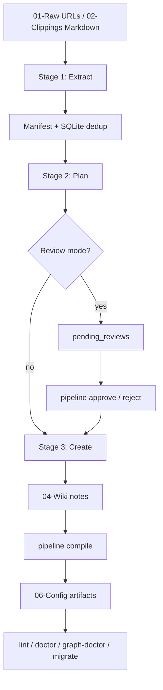
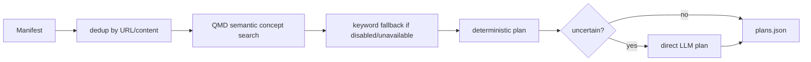

# Obsidian LLM Wiki — Architecture

**Version:** 0.3.0
**Date:** 2026-04-28
**Pipeline code:** ~16,575 Python lines in `pipeline/`
**Test baseline:** 852 passing tests
**Console script:** `pipeline = pipeline.cli:app`

## Design thesis

Obsidian LLM Wiki is a local-first knowledge pipeline. It converts raw inputs into an Obsidian-native wiki while keeping the filesystem, graph, and release gates deterministic.

The central architectural decision is blunt and important:

> LLMs provide bounded semantic judgment. Python owns paths, frontmatter, validation, graph artifacts, migrations, and writes.

That split is what makes the project auditable. Letting an agent directly write arbitrary notes was cute until it became a data-integrity problem. The current design treats the LLM as a component, not a sysadmin with vibes.

## System overview



## Component map

```text
pipeline/
├── cli/
│   ├── _helpers.py         shared CLI config, locking, query helpers
│   ├── ingest.py           extract → plan → create orchestration
│   ├── compile_cmd.py      compile command wrapper
│   ├── review_cmd.py       approve/reject/review-status
│   ├── quality.py          lint, validate, doctor, config-doctor, release-check
│   └── manage.py           init, stats, tags, query, fixture, graph-doctor, migrate
├── compile/
│   ├── core.py             CompileResult, incremental state, compile orchestration
│   ├── semantic.py         cross-link, concept merge, MoC semantic operations
│   ├── structural.py       wiki-index, edges, duplicate report
│   └── watch.py            incremental watch support
├── create/
│   ├── templates.py        deterministic template creation + bounded LLM insights
│   ├── orchestrator.py     batch coordination
│   ├── validate.py         post-create validation and auto-repair
│   ├── prompts.py          prompt construction
│   └── agent.py            legacy/compatibility agent creation path
├── extractors/
│   ├── _shared.py          URL safety, curl helpers, title extraction, transcription
│   ├── web.py              web/PDF extraction fallback chain
│   ├── youtube.py          transcript APIs and canonical YouTube fallback
│   └── podcast.py          RSS/audio extraction
├── lint/                   health checks, fixes, models, runner
├── assets/                 packaged prompt and note-template assets
├── graph_doctor.py         graph integrity diagnostics
├── migrations.py           idempotent vault schema/assets migrations
├── fixtures.py             deterministic and adversarial fixture vaults
├── qmd.py                  QMD MCP semantic search facade
├── qmd_mcp.py              QMD result conversion/client details
├── vault.py                vault file operations, MoC/index/edge writes
├── review.py               staged review approval/rejection
├── store.py                SQLite content store, review queue, cache
├── config.py               environment and vault path resolution
├── llm_client.py           Ollama/OpenRouter/Hermes LLM abstraction
└── utils.py                filename/path safety, prompt loading, shared helpers
```

## Stage 1: Extract

Stage 1 is deterministic. It produces `ExtractedSource` entries and a `Manifest`.

| Input | Primary path | Fallback path |
|---|---|---|
| Web article / X / PDF | defuddle / liteparse | curl extraction → archive.org → camoufox where available |
| YouTube | transcript API | Supadata → canonical `yt-dlp` URL → faster-whisper |
| Podcast | RSS/audio + AssemblyAI | local whisper |
| Markdown clipping | direct ingest from `02-Clippings/` | none |

### Network boundary model

The extractor layer is security-sensitive because it touches arbitrary URLs.

Controls:

1. URLs must parse as `http`/`https`.
2. Embedded credentials are rejected.
3. localhost, `.localhost`, private, loopback, link-local, multicast, reserved, and unspecified IP targets are rejected.
4. Weird IPv4 encodings accepted by curl are normalized and checked.
5. DNS resolution is checked before fetch.
6. curl calls add `--resolve host:port:public_ip` and abort if a safe public pin cannot be established.
7. Secret headers are passed through stdin curl config, not argv.
8. YouTube routing validates allowed hostnames and then canonicalizes to `https://www.youtube.com/watch?v={video_id}`.

## Stage 2: Plan

Planning decides note shape, tags, concepts, and MoC targets.



QMD MCP is optional. `USE_QMD_MCP=false|0|no|off` disables client construction completely. If QMD is unavailable, local keyword fallback keeps the pipeline usable.

## Stage 3: Create

Creation is template-first and path-safe.

Responsibilities owned by Python:

- choose templates;
- build YAML/frontmatter safely;
- generate wikilinks and aliases;
- create source/entry/concept/MoC files;
- ensure entry/source stems are distinct;
- handle collisions;
- validate batch output;
- update tag registry, wiki index, and MoC membership.

Responsibilities allowed for LLM:

- bounded entry insight text;
- filename shortening suggestions that are re-sanitized;
- semantic judgment during compile.

### Filename and path boundary

All note identifiers pass through `safe_note_stem()` and write targets pass through containment checks.

Important invariants:

- `/`, `\`, `..`, drive prefixes, control chars, and path-like LLM output do not carry path semantics.
- `safe_note_path(base_dir, stem)` always resolves under `base_dir`.
- `assert_path_within(base_dir, target)` is the last line of defense before write.
- Review rows are not trusted just because they came from SQLite.

## Review workflow

`pipeline ingest --review` stages plans in `pending_reviews`. Approval is designed to prevent corrupt half-writes.

Approval algorithm:

1. Load pending rows grouped by `plan_hash`.
2. Map `file_type` to the allowed vault collection.
3. Validate paths with containment checks.
4. Validate all staged content before final writes.
5. Write temp files.
6. Atomically replace final files.
7. If a later replace fails, roll back already-replaced files.
8. Mark rows approved only after the plan succeeds.

This is not database-perfect distributed transactionality, but it is the right local-filesystem compromise: fail closed, write nothing on validation failure, and roll back final replace failures.

## Compile pass

`pipeline compile` has semantic and deterministic halves.

### Semantic half

- Cross-link candidate generation uses tags, title tokens, and bounded fallback windows before expensive pair scoring.
- QMD embeddings are consumed when available.
- Empty LLM output when candidates exist is degraded/failure, not success.
- `CompileResult` exposes:
  - `semantic_status`
  - `semantic_degraded_reason`
  - counts for crosslinks, merges, MoC updates, edges, duplicates.

### Deterministic half

- `wiki-index.md` rebuild.
- `edges.tsv` rebuild from resolvable wikilinks and provenance links.
- duplicate report rewrite, including zero-duplicate state.
- compile log/report write.
- edge cache invalidation after direct edge rewrites.

## Graph model

Graph nodes are Obsidian note stems from four collections:

- `04-Wiki/sources`
- `04-Wiki/entries`
- `04-Wiki/concepts`
- `04-Wiki/mocs`

`edges.tsv` format:

```text
source<TAB>target<TAB>type<TAB>description
```

Relationship types include:

```text
extends, contradicts, supports, supersedes, tested_by,
depends_on, inspired_by, part_of, relates_to
```

Source notes are first-class graph nodes. This preserves entry→source provenance and prevents the graph from lying about where claims came from.

## Diagnostics

### doctor / config-doctor

Validate runtime readiness and emit redacted configuration data.

```bash
pipeline doctor ~/MyVault --json
pipeline config-doctor ~/MyVault --json
```

### graph-doctor

Reports:

- unresolved wikilinks;
- stale edge rows;
- malformed edge rows;
- duplicate stems across note collections.

```bash
pipeline graph-doctor ~/MyVault --json
```

### migrate

Current schema version: `1`.

`pipeline migrate` backfills vault structure/assets and writes:

```text
06-Config/schema-version.json
```

```bash
pipeline migrate ~/MyVault --yes --json
```

### fixture

Two fixture modes exist:

- default deterministic example vault;
- adversarial golden corpus with CJK titles, malicious filenames, quoted URLs, staged collisions, broken links, and other regression bait.

```bash
pipeline fixture ~/MyVault --adversarial --overwrite --json
```

## Vault structure

```text
01-Raw/
02-Clippings/
03-Queries/
04-Wiki/
├── sources/
├── entries/
├── concepts/
└── mocs/
05-Outputs/
06-Config/
├── wiki-index.md
├── tag-registry.md
├── edges.tsv
├── log.md
└── schema-version.json
07-WIP/
08-Archive-Raw/
09-Archive-Queries/
10-Archive-Clippings/
Meta/
├── Scripts/
├── prompts/
└── Templates/
```

`07-WIP/` is a hard boundary: automation must not touch it.

## Packaged assets

Canonical default prompts/templates live under:

```text
pipeline/assets/prompts/
pipeline/assets/templates/
```

`pipeline init` seeds runtime copies into:

```text
Meta/prompts/
Meta/Templates/
```

Expected installed-wheel asset counts:

- prompts: `8`
- templates: `9`

Runtime vault-local assets may override packaged defaults. Repo-root `prompts/` and `templates/` are not canonical and must not be reintroduced.

## Query architecture

`pipeline query` has two modes:

- `--fast`: direct LLM query over wiki index/snippets.
- default: configured agent command (`AGENT_CMD`) for deeper tool-assisted Q&A.

Empty successful stdout from the non-fast agent path is treated as failure and the query is not archived. Success means usable content exists, not merely `returncode == 0`.

## Release architecture

A green source test suite is necessary but not sufficient. The release artifact must work when installed from a wheel.

Required gates:

```bash
ruff check .
pyflakes pipeline tests
pytest -q
git diff --check
python3 -m pip wheel . -w /tmp/obsidian-llm-wiki-wheel --no-deps
python3 -m venv /tmp/obsidian-llm-wiki-venv
/tmp/obsidian-llm-wiki-venv/bin/pip install /tmp/obsidian-llm-wiki-wheel/*.whl
/tmp/obsidian-llm-wiki-venv/bin/pipeline init /tmp/obsidian-llm-wiki-vault
/tmp/obsidian-llm-wiki-venv/bin/pipeline fixture /tmp/obsidian-llm-wiki-vault --adversarial --overwrite --json
/tmp/obsidian-llm-wiki-venv/bin/pipeline graph-doctor /tmp/obsidian-llm-wiki-vault --json
/tmp/obsidian-llm-wiki-venv/bin/pipeline migrate /tmp/obsidian-llm-wiki-vault --yes --json
```

## Current risks and future work

1. The migration system is intentionally minimal at schema version `1`; future schema-changing features should add named migrations, not ad hoc backfills.
2. `graph-doctor` reports issues but does not yet offer a repair mode. That is the obvious next product step.
3. Semantic candidate blocking reduces common-case cost, but very large vaults will eventually need persisted inverted indexes or a proper local search service.
4. The legacy agent creation path exists for compatibility. It should stay off the default path unless a future release removes it with a migration note.
